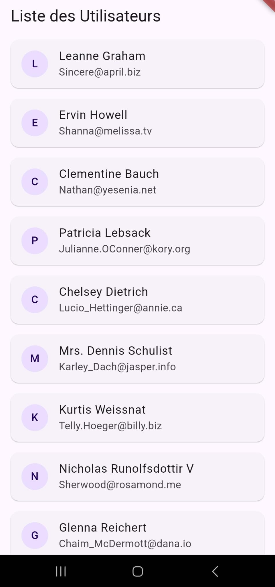

# Flutter MVVM App with Provider

This Flutter project demonstrates the **MVVM (Model-View-ViewModel)** architecture pattern, combined with the **Provider** package for state management. The application fetches a list of users from the JSONPlaceholder API and displays them in a list view. The code is structured to provide clean separation between different layers: Models, ViewModels, Repositories, Screens (Views), and Widgets.

## Features

- **MVVM Architecture**: Clean separation between UI, business logic, and data handling.
- **State Management**: Utilizes the **Provider** package to handle state and notify listeners of changes.
- **API Integration**: Fetches user data from [JSONPlaceholder](https://jsonplaceholder.typicode.com/users).

## Project Structure

```
lib/
├── models/               # Contains data models (User, Address, etc.)
├── repositories/         # Handles API requests (UserRepository)
├── view_models/          # ViewModel layer for managing the app's state (UserViewModel)
├── screens/              # UI Screens (UserScreen)
├── widgets/              # Reusable UI components (UserWidget)
└── main.dart             # App entry point
```

## Installation

To install and run this project locally, follow these steps:

### Prerequisites

- You need to have **Flutter** installed. Follow the instructions on the official [Flutter installation page](https://flutter.dev/docs/get-started/install).
- Ensure you have a valid device/emulator set up for Flutter development.

### Steps

1. **Clone the repository:**

   ```bash
   git clone https://github.com/djamel-madani-dev/user_mvvm.git
   cd flutter-mvvm-app
   ```

2. **Install dependencies:**

   ```bash
   flutter pub get
   ```

3. **Run the app:**
   ```bash
   flutter run
   ```

This will start the app on your connected device or emulator.

## How it works

1. The `UserRepository` makes a GET request to the [JSONPlaceholder](https://jsonplaceholder.typicode.com/users) API to fetch a list of users.
2. The `UserViewModel` handles the logic for fetching data and managing the app's state.
3. The `UserScreen` displays the list of users by observing the state provided by `UserViewModel` through **Provider**.
4. The `UserWidget` displays individual user data in the list.

## Screenshot



## License

This project is licensed under the MIT License.
